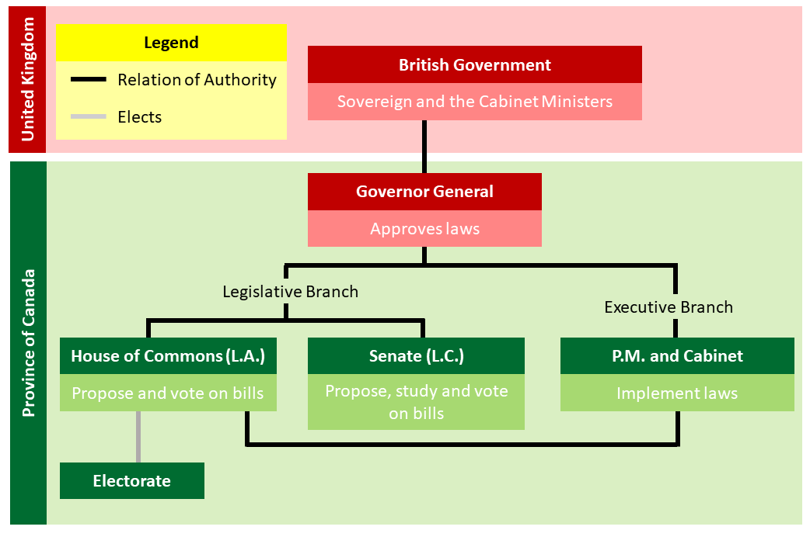

# British North America Act

### BNA Act *(July 1st, 1867)*

* [Dominion](#dominion) of Canada was created under a [constitutional monarchy](#constitutional-monarchy).
* Four provinces: Nova Scotia, New Brunswick, Quebec, Ontario.
  * Prince Edward Island and Newfoundland remained British Colonies.
* The Dominion of Canada purchased Rupert's land from the Hudson's Bay Company *(1869)*.
  * Territorial Consequence: creation of Manitoba *(1870)*.

### Dominion of Canada within the empire

* The Dominion of Canada could not modify their constitution without the permission from the UK.

#### The levels of government in the Province of Canada *(1867)*

#### The federal government *(1867)*

#### Federal and Provincial Government Jurisdictions

| Federal Jurisdiction                                         | Provincial Jurisdictions                                     | Shared Jurisdictions                                         |
| ------------------------------------------------------------ | ------------------------------------------------------------ | ------------------------------------------------------------ |
| Indian Affairs Trade Defence and Military Criminal Law Custom Duties Currency and Banking Navigation and Shipping Postal Service Power of Disallowance Residual Powers Taxes | Civil Law Education Municipalities Natural Resources and Raw Materials Health Care | Agriculture Economic Development Immigration Income Taxes Fishing Prisons and Justice Transportation Public Works |

# Definitions

#### Dominion

An autonomous member state of the British Commonwealth. They have control of their internal affairs, but the UK still controls their external affairs.

#### Constitutional Monarchy

A political system in which the head of state is a king or queen whose powers are limited by a constitution.